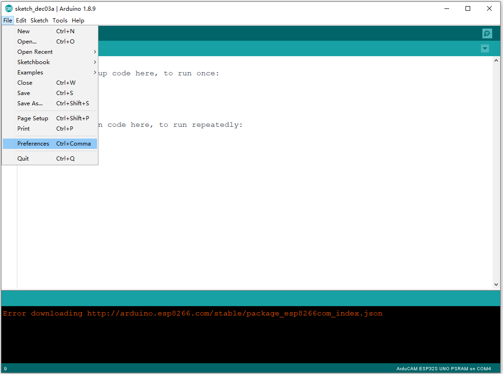
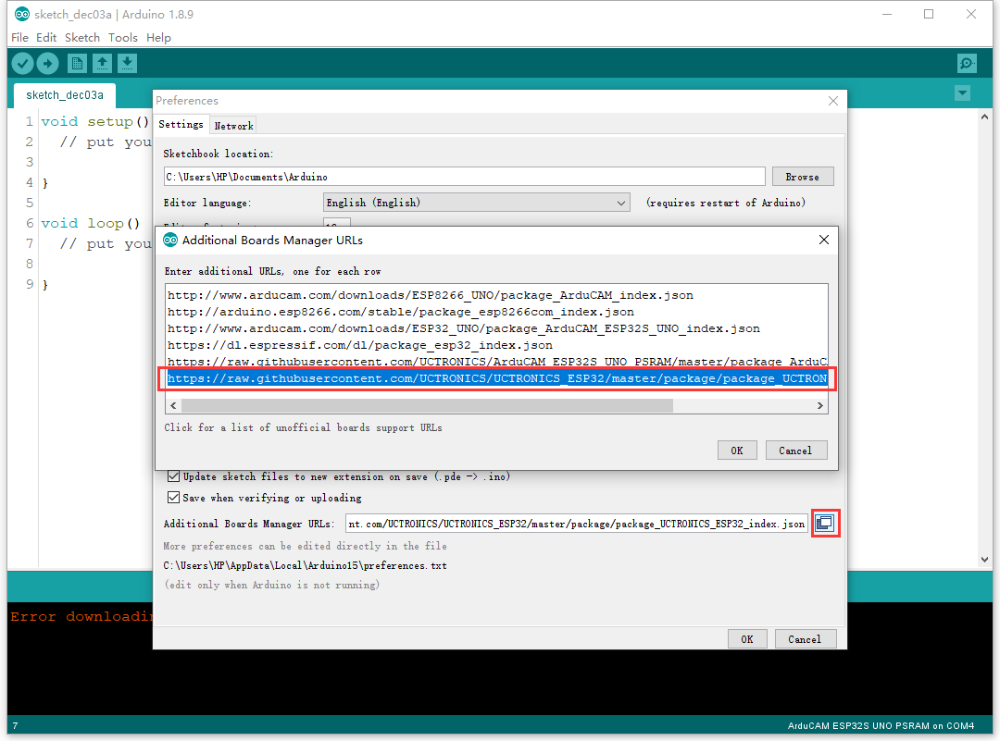
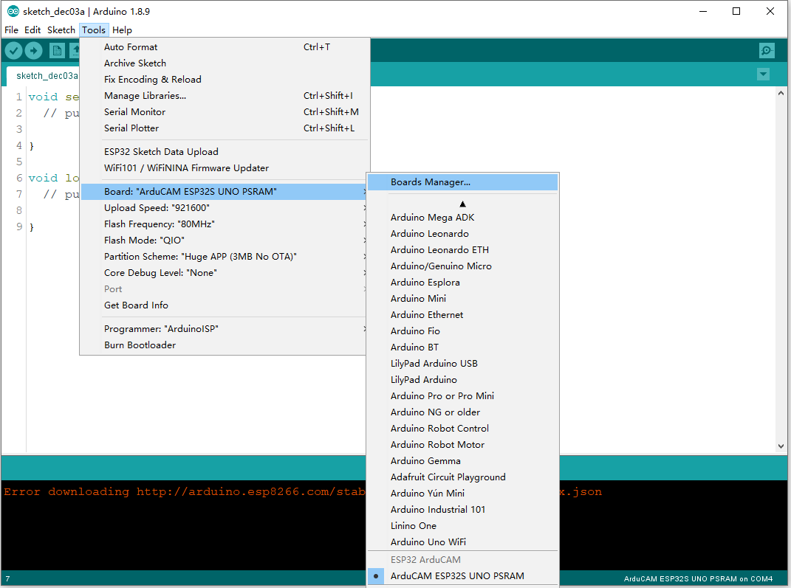
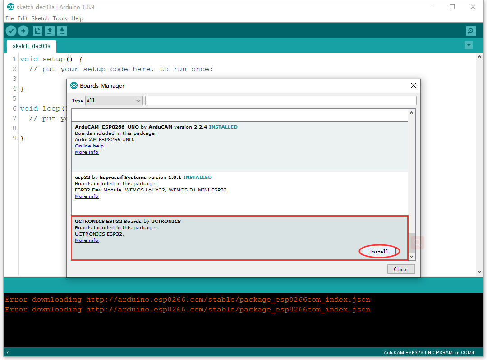
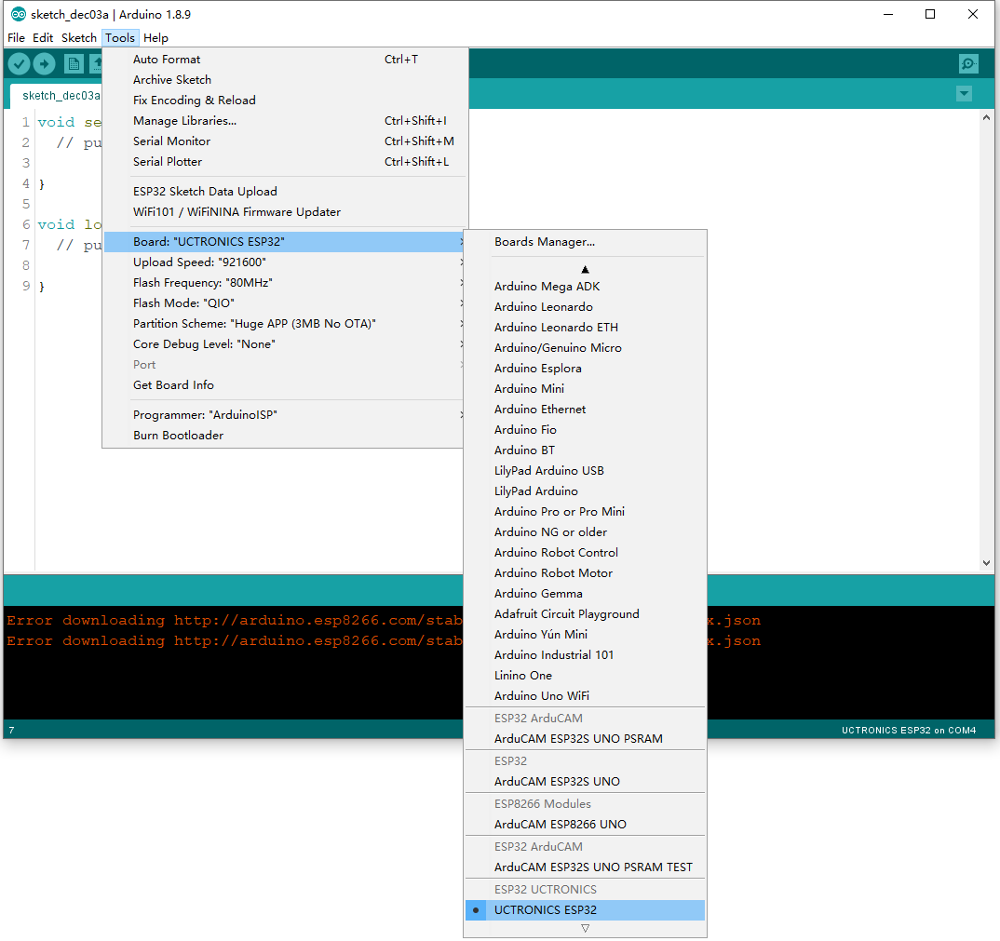
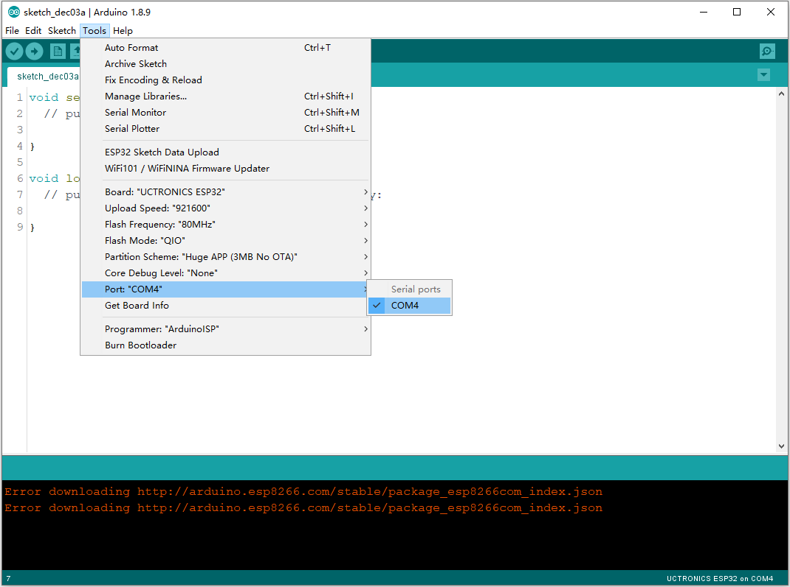
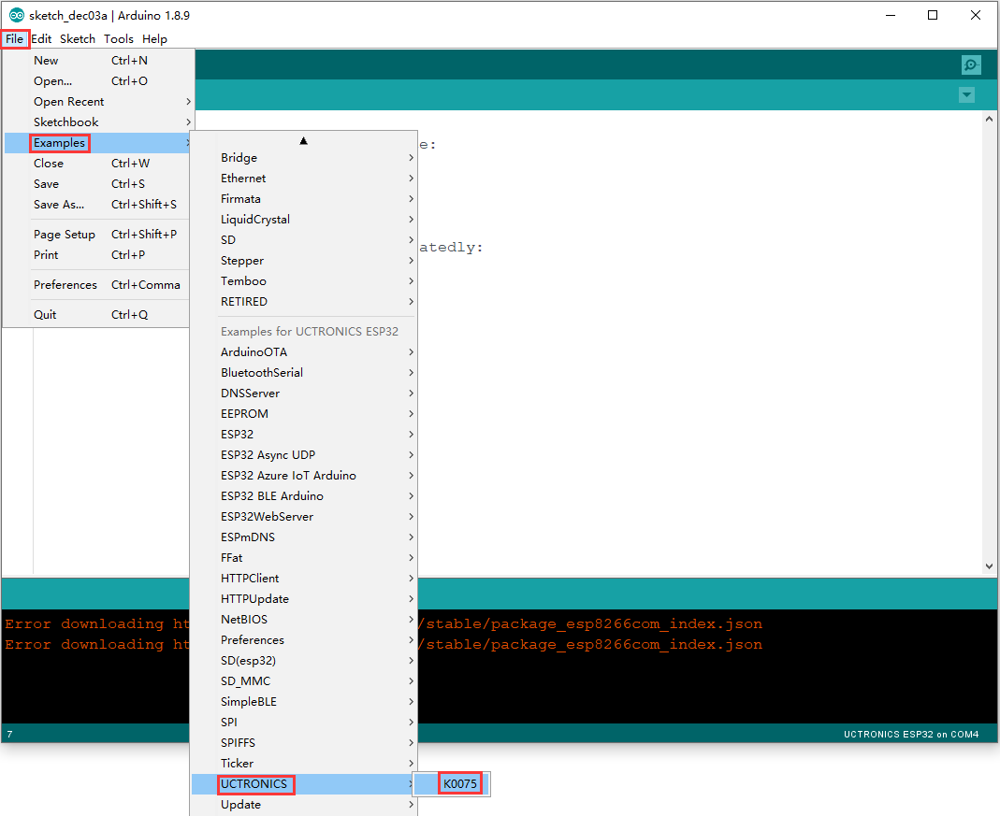
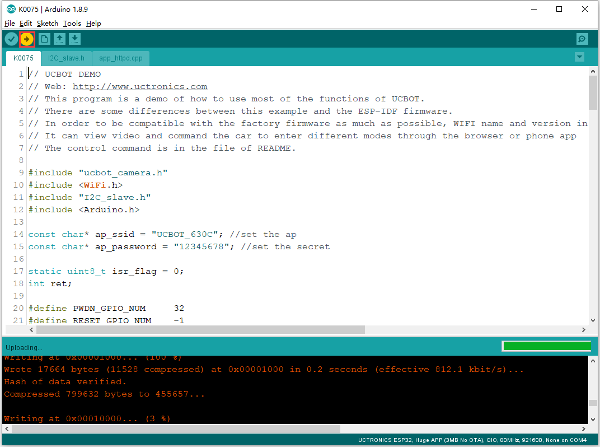
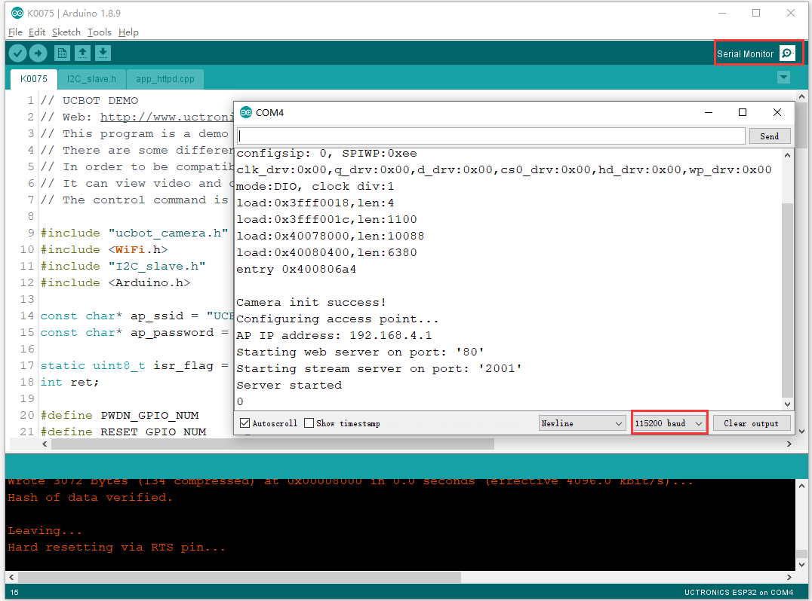

# UCTRONICS_ESP32
UCTRONICS_ESP32 is a smart robot car development board.

## Installation Instructions

Installation instructions using Arduino IDE Boards Manager. Starting with 1.8.9, Arduino allows installation of third-party platform packages using Boards Manager. We have packages available for Windows, Mac OS, and Linux (32 and 64 bit).

- Install the current upstream Arduino IDE at the 1.8.9 level or later. The current version is at the [Arduino website](http://www.arduino.cc/en/main/software).
- Start Arduino and open Preferences window.

- Enter ```https://raw.githubusercontent.com/UCTRONICS/UCTRONICS_ESP32/master/package/package_UCTRONICS_ESP32_index.json``` into *Additional Board Manager URLs* field. You can add multiple URLs, separating them with commas.

- Open Boards Manager from Tools > Board menu and install *UCTRONICS ESP32 Boards* platform (and don't forget to select your ESP32 board from Tools > Board menu after installation).



## Quickly run the demo 
- Choose the ArduCAM_ESP32S_UNO_PSRAM board.

- Choose the right port.

- Choose one example.

- Compile and upload the demo.

- Open the serial port to check the debug message.


#### Issue/Bug report template
Before reporting an issue, make sure you've searched for similar one that was already created. You also can rase your question on [Arducam forum](https://www.arducam.com/forums/).

## Hint

Sometimes to program ESP32 via serial you must keep GPIO0 LOW during the programming process
